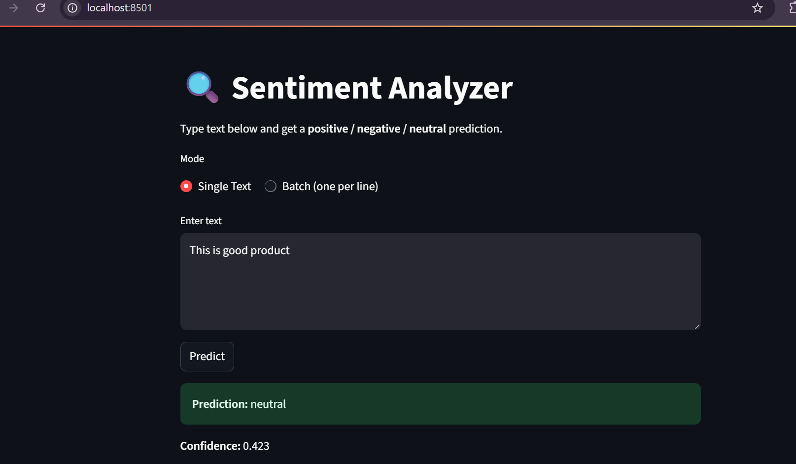

# Sentiment_analysis_project
## Overview
This project is an **AI/ML prototype** built with Python.  
It is designed as a starting point for experimenting with machine learning workflows, including **data preprocessing, model training, and evaluation**.  
It also demonstrates how to set up a **virtual environment** and use **Git** for version control.
## Features
- Clean and organized project structure  
- Python virtual environment (`venv`)  
- Git version control integration  
- Ready-to-use template for AI/ML projects  
- Support for adding datasets, training scripts, and Jupyter notebooks  
## Setup Instructions
### 1. Clone the Repository
```bash
git clone https://github.com/your-username/New_project.git
cd New_project
### 2. Result

